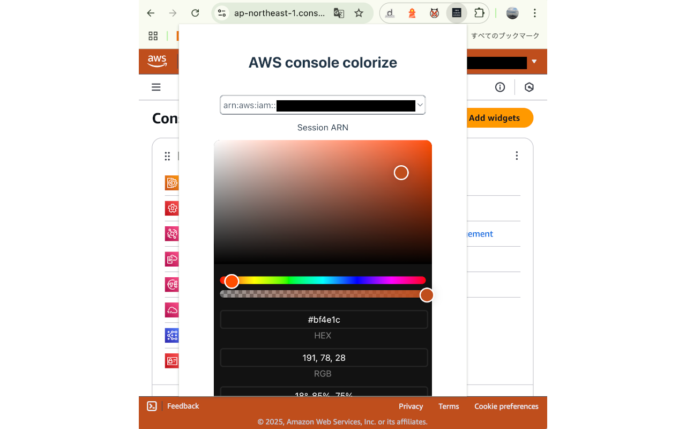

# AWS management console colorize

Chrome and Firefox extensions to change the header and footer colors of the AWS management console.  
You can change the header and footer colors of the AWS management console to your preference.  
This is to differentiate between multiple session ARNs.  
This is inspired by [gcp-console-colorize](https://github.com/yfuruyama/gcp-console-colorize).



## Development

### Settings

You can install `pre-commit` by following the instructions at <https://pre-commit.com/>.  
`pre-commit` ensures that your credentials are not included in your commit at commit time.

### Install packages

1. Install `bun` according to [`bun` official website](https://bun.sh/docs/installation)
2. Install packages using the following command:
   ```Shell
   bun install
   ```

### Build for production and zip output

The zip will be output in the `dist` directory.

```shell
# For Chrome extension
bun run zip:chrome

# For Firefox extension
bun run zip:firefox
```
