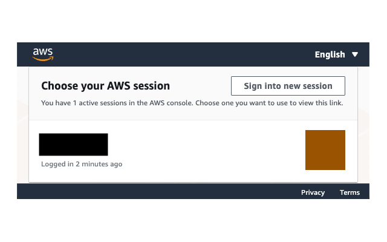

# AWS management console colorize

Chrome and Firefox extensions to change and add colors in the AWS management console.  
Those extensions offers the following features:

- Change the header and footer colors of the AWS management console.
- Add color blocks to the AWS session selection page.

These allow you to differentiate between multiple session ARNs.  
These are inspired by [gcp-console-colorize](https://github.com/yfuruyama/gcp-console-colorize).




## Download

- Chrome: <https://chromewebstore.google.com/detail/aws-management-console-co/ihllnndjleheembkonidbocncnnedhcf>
- Firefox: <https://addons.mozilla.org/ja/firefox/addon/aws-console-colorize/>

## Development

### Settings

You can install `pre-commit` by following the instructions at <https://pre-commit.com/>.  
`pre-commit` ensures that your credentials are not included in your commit at commit time.

### Install packages

1. Install `bun` according to [`bun` official site](https://bun.sh/docs/installation)
2. Install packages using the following command:
   ```Shell
   bun install
   ```

### Build for production and ZIP output

The ZIP will be output in the `dist` directory.

```shell
# For Chrome extension
bun run zip:chrome

# For Firefox extension
bun run zip:firefox
```
